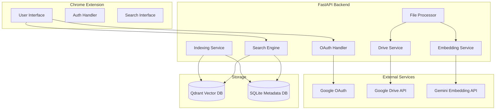
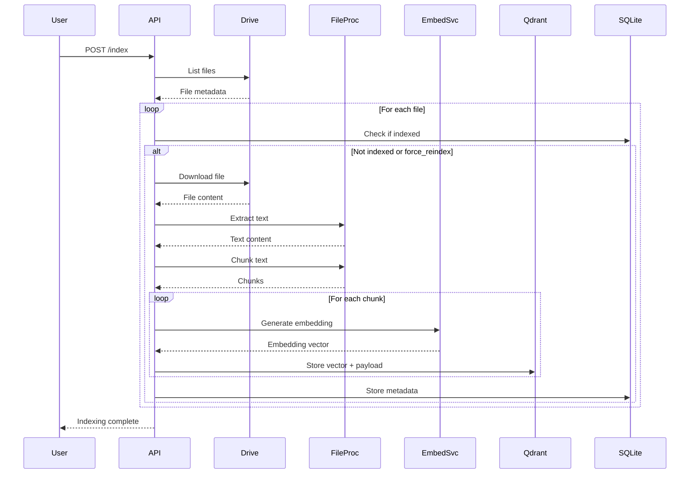
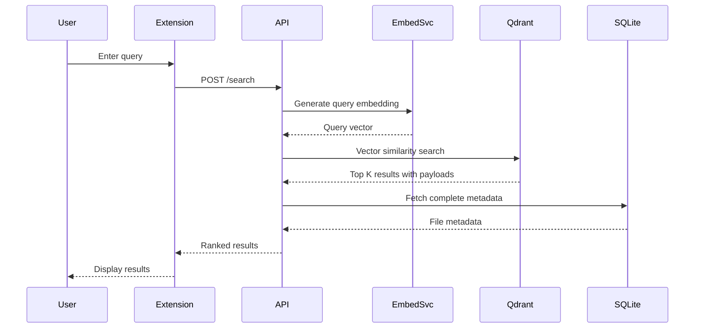

# Design Document: Glaze Semantic Search

## Overview

Glaze is a semantic search system that enables natural language queries over Google Drive files. The architecture consists of three primary layers:

1. **Frontend Layer**: Chrome Extension providing the user interface
2. **Backend Layer**: FastAPI server orchestrating authentication, indexing, and search
3. **Storage Layer**: Qdrant vector database and SQLite metadata store

The system workflow follows this pattern:
- User authenticates via Google OAuth 2.0
- Backend fetches Drive files and extracts text content
- Content is chunked and converted to embeddings via Google Gemini
- Embeddings are stored in Qdrant with metadata in SQLite
- User queries are embedded and matched against stored vectors
- Results are ranked by semantic similarity and returned with metadata

## Architecture

### System Components



### Component Responsibilities

**Chrome Extension**
- Renders search UI and authentication flows
- Manages user session state
- Communicates with Backend API via HTTP
- Displays search results with Drive links

**OAuth Handler**
- Implements Google OAuth 2.0 flow
- Manages access token lifecycle (refresh, expiration)
- Securely stores credentials

**Drive Service**
- Fetches file lists from Google Drive API
- Handles pagination for large file sets
- Filters files by supported MIME types

**File Processor**
- Downloads file content from Drive
- Extracts text from PDF, DOCX, TXT, PPT, PPTX
- Chunks content into 500-1000 token segments
- Handles extraction errors gracefully

**Embedding Service**
- Generates embeddings using Gemini multimodal-embedding-002
- Batches requests for efficiency
- Implements rate limiting and retry logic

**Indexing Service**
- Orchestrates file processing pipeline
- Stores embeddings in Qdrant
- Stores metadata in SQLite
- Implements incremental indexing logic

**Search Engine**
- Embeds user queries
- Performs vector similarity search
- Joins results with metadata
- Ranks and returns top results

## Components and Interfaces

### API Specifications

#### Authentication Endpoints

**POST /auth/google**
```json
Request: {}
Response: {
  "auth_url": "https://accounts.google.com/o/oauth2/v2/auth?..."
}
Status: 200 OK | 500 Internal Server Error
```

**GET /auth/callback**
```
Query Parameters:
  - code: string (authorization code from Google)
  - state: string (CSRF token)

Response: {
  "access_token": "ya29...",
  "refresh_token": "1//...",
  "expires_in": 3600
}
Status: 200 OK | 400 Bad Request | 500 Internal Server Error
```

#### Drive Endpoints

**GET /drive/files**
```
Headers:
  - Authorization: Bearer <access_token>

Query Parameters:
  - page_token: string (optional, for pagination)

Response: {
  "files": [
    {
      "id": "1abc...",
      "name": "document.pdf",
      "mimeType": "application/pdf",
      "webViewLink": "https://drive.google.com/file/d/..."
    }
  ],
  "nextPageToken": "token123" | null
}
Status: 200 OK | 401 Unauthorized | 500 Internal Server Error
```

#### Indexing Endpoints

**POST /index**
```json
Headers:
  - Authorization: Bearer <access_token>

Request: {
  "file_ids": ["1abc...", "2def..."],  // optional, defaults to all files
  "force_reindex": false  // optional
}

Response: {
  "status": "completed",
  "indexed_count": 42,
  "skipped_count": 8,
  "failed_count": 2,
  "errors": [
    {
      "file_id": "3xyz...",
      "error": "Failed to extract text from PDF"
    }
  ]
}
Status: 200 OK | 401 Unauthorized | 500 Internal Server Error
```

#### Search Endpoints

**POST /search**
```json
Headers:
  - Authorization: Bearer <access_token>

Request: {
  "query": "machine learning papers",
  "limit": 10  // optional, default 10
}

Response: {
  "results": [
    {
      "file_id": "1abc...",
      "file_name": "ML_Research.pdf",
      "mime_type": "application/pdf",
      "link": "https://drive.google.com/file/d/...",
      "chunk_text": "...relevant excerpt...",
      "score": 0.87
    }
  ],
  "query_time_ms": 234
}
Status: 200 OK | 401 Unauthorized | 500 Internal Server Error
```

### Internal Interfaces

**FileProcessor Interface**
```python
class FileProcessor:
    def extract_text(self, file_id: str, mime_type: str) -> str:
        """Extract text content from a Drive file"""
        
    def chunk_text(self, text: str, chunk_size: int = 750) -> List[str]:
        """Split text into chunks of approximately chunk_size tokens"""
```

**EmbeddingService Interface**
```python
class EmbeddingService:
    def generate_embedding(self, text: str) -> List[float]:
        """Generate embedding vector for text"""
        
    def generate_embeddings_batch(self, texts: List[str]) -> List[List[float]]:
        """Generate embeddings for multiple texts"""
```

**IndexingService Interface**
```python
class IndexingService:
    def index_file(self, file_id: str, file_metadata: dict) -> IndexResult:
        """Process and index a single file"""
        
    def is_indexed(self, file_id: str) -> bool:
        """Check if file is already indexed"""
        
    def delete_file_embeddings(self, file_id: str) -> None:
        """Remove all embeddings for a file"""
```

**SearchEngine Interface**
```python
class SearchEngine:
    def search(self, query: str, limit: int = 10) -> List[SearchResult]:
        """Perform semantic search and return ranked results"""
```

## Data Models

### Qdrant Schema

**Collection: drive_files**
```python
{
    "vectors": {
        "size": 768,  # Gemini embedding dimension
        "distance": "Cosine"
    }
}
```

**Point Structure**
```python
{
    "id": "uuid-v4",  # unique chunk identifier
    "vector": [0.123, -0.456, ...],  # 768-dimensional embedding
    "payload": {
        "file_id": "1abc...",
        "file_name": "document.pdf",
        "chunk_text": "...content...",
        "mime_type": "application/pdf",
        "chunk_index": 0
    }
}
```

### SQLite Schema

**Table: files**
```sql
CREATE TABLE files (
    id INTEGER PRIMARY KEY AUTOINCREMENT,
    file_id TEXT UNIQUE NOT NULL,
    file_name TEXT NOT NULL,
    mime_type TEXT NOT NULL,
    link TEXT NOT NULL,
    indexed_at TIMESTAMP DEFAULT CURRENT_TIMESTAMP,
    modified_time TEXT  -- Drive's modifiedTime for incremental indexing
);

CREATE INDEX idx_file_id ON files(file_id);
```

**Table: indexing_status**
```sql
CREATE TABLE indexing_status (
    file_id TEXT PRIMARY KEY,
    status TEXT NOT NULL,  -- 'pending', 'completed', 'failed'
    chunk_count INTEGER DEFAULT 0,
    error_message TEXT,
    last_attempt TIMESTAMP DEFAULT CURRENT_TIMESTAMP,
    FOREIGN KEY (file_id) REFERENCES files(file_id)
);
```

### Python Data Models

**FileMetadata**
```python
@dataclass
class FileMetadata:
    file_id: str
    file_name: str
    mime_type: str
    link: str
    modified_time: Optional[str] = None
```

**Chunk**
```python
@dataclass
class Chunk:
    chunk_id: str
    file_id: str
    file_name: str
    chunk_index: int
    text: str
    mime_type: str
```

**SearchResult**
```python
@dataclass
class SearchResult:
    file_id: str
    file_name: str
    mime_type: str
    link: str
    chunk_text: str
    score: float
```

**IndexResult**
```python
@dataclass
class IndexResult:
    file_id: str
    status: str  # 'success', 'skipped', 'failed'
    chunk_count: int
    error: Optional[str] = None
```

### File Processing Pipeline



### Search Workflow



### Embedding Generation Workflow

The Embedding Service implements batching and retry logic:

1. **Batching**: Group chunks into batches of 10 for API efficiency
2. **Rate Limiting**: Respect Gemini API rate limits (15 requests/minute for free tier)
3. **Retry Logic**: Exponential backoff for transient failures
   - Initial delay: 1 second
   - Max retries: 3
   - Backoff multiplier: 2

```python
def generate_embeddings_with_retry(texts: List[str]) -> List[List[float]]:
    for attempt in range(MAX_RETRIES):
        try:
            return gemini_api.embed(texts)
        except RateLimitError:
            if attempt < MAX_RETRIES - 1:
                sleep(2 ** attempt)
            else:
                raise
        except TransientError:
            if attempt < MAX_RETRIES - 1:
                sleep(2 ** attempt)
            else:
                raise
```

### Chrome Extension Architecture

**Manifest V3 Configuration**
```json
{
  "manifest_version": 3,
  "name": "Glaze - Semantic Drive Search",
  "version": "1.0.0",
  "permissions": ["storage", "identity"],
  "host_permissions": ["http://localhost:8000/*"],
  "action": {
    "default_popup": "popup.html"
  },
  "background": {
    "service_worker": "background.js"
  },
  "content_security_policy": {
    "extension_pages": "script-src 'self'; object-src 'self'"
  }
}
```

**Component Structure**
- `popup.html`: Main UI with search input and results display
- `popup.js`: Handles user interactions and API communication
- `background.js`: Manages OAuth flow and token storage
- `styles.css`: UI styling

**State Management**
```javascript
// Stored in chrome.storage.local
{
  "access_token": "ya29...",
  "refresh_token": "1//...",
  "token_expiry": 1234567890,
  "user_email": "user@example.com"
}
```


## Security Considerations

### Authentication Security

**OAuth 2.0 Implementation**
- Use PKCE (Proof Key for Code Exchange) flow for enhanced security
- Store tokens in secure storage (chrome.storage.local for extension, environment variables for backend)
- Implement CSRF protection using state parameter
- Never expose client secrets in frontend code

**Token Management**
- Access tokens expire after 1 hour
- Refresh tokens automatically before expiration
- Invalidate tokens on logout
- Use HTTPS for all API communication

### API Security

**CORS Configuration**
```python
# Only allow requests from Chrome Extension
ALLOWED_ORIGINS = [
    "chrome-extension://<extension-id>"
]
```

**Request Validation**
- Validate all input parameters
- Sanitize file names and content
- Implement rate limiting per user (100 requests/hour)
- Validate MIME types against whitelist

**Data Protection**
- Never log access tokens or refresh tokens
- Encrypt sensitive data at rest
- Use parameterized queries to prevent SQL injection
- Validate file sizes before processing (max 50MB)

### Content Security Policy

Chrome Extension CSP prevents XSS attacks:
```
script-src 'self'; object-src 'self'; connect-src http://localhost:8000
```

## Performance Optimizations

### Indexing Performance

**Parallel Processing**
- Process multiple files concurrently (max 5 concurrent)
- Batch embedding generation (10 chunks per batch)
- Use connection pooling for Qdrant and SQLite

**Incremental Indexing**
- Track file modification times
- Skip unchanged files
- Only re-index modified files
- Maintain indexing status table

**Chunking Strategy**
- Target chunk size: 750 tokens (500-1000 range)
- Use sliding window with 100 token overlap for context preservation
- Optimize chunk boundaries at sentence breaks

### Search Performance

**Vector Search Optimization**
- Use HNSW index in Qdrant for fast approximate search
- Set ef_construct=100, m=16 for balanced speed/accuracy
- Limit search to top 10 results by default
- Cache query embeddings for repeated searches (5-minute TTL)

**Database Optimization**
```sql
-- Index for fast file_id lookups
CREATE INDEX idx_file_id ON files(file_id);

-- Index for incremental indexing checks
CREATE INDEX idx_modified_time ON files(modified_time);
```

**Response Time Targets**
- Search queries: < 2 seconds (p95)
- File indexing: < 5 seconds per file (p95)
- Authentication: < 1 second (p95)

### Resource Management

**Memory Management**
- Stream large files instead of loading into memory
- Clear processed chunks after embedding generation
- Limit concurrent file processing to prevent memory exhaustion

**API Rate Limiting**
- Gemini API: 15 requests/minute (free tier)
- Google Drive API: 1000 requests/100 seconds per user
- Implement exponential backoff for rate limit errors

## Error Handling

### Error Categories

**Authentication Errors**
```python
class AuthenticationError(Exception):
    """OAuth flow failed or token invalid"""
    
class TokenExpiredError(AuthenticationError):
    """Access token expired and refresh failed"""
```

**File Processing Errors**
```python
class FileProcessingError(Exception):
    """Failed to extract text from file"""
    
class UnsupportedFileTypeError(FileProcessingError):
    """File MIME type not supported"""
    
class FileSizeExceededError(FileProcessingError):
    """File exceeds maximum size limit"""
```

**Embedding Errors**
```python
class EmbeddingError(Exception):
    """Failed to generate embedding"""
    
class RateLimitError(EmbeddingError):
    """API rate limit exceeded"""
    
class QuotaExceededError(EmbeddingError):
    """API quota exhausted"""
```

**Storage Errors**
```python
class StorageError(Exception):
    """Failed to store data"""
    
class QdrantConnectionError(StorageError):
    """Cannot connect to Qdrant"""
    
class DatabaseError(StorageError):
    """SQLite operation failed"""
```

### Error Handling Strategy

**Graceful Degradation**
- If one file fails, continue processing remaining files
- Return partial results with error details
- Log errors for debugging without exposing sensitive data

**User-Facing Error Messages**
```python
ERROR_MESSAGES = {
    "auth_failed": "Authentication failed. Please try logging in again.",
    "drive_unavailable": "Cannot connect to Google Drive. Please check your connection.",
    "indexing_failed": "Some files could not be indexed. See details below.",
    "search_failed": "Search failed. Please try again.",
    "rate_limit": "Too many requests. Please wait a moment and try again."
}
```

**Retry Logic**
```python
@retry(
    stop=stop_after_attempt(3),
    wait=wait_exponential(multiplier=1, min=1, max=10),
    retry=retry_if_exception_type((RateLimitError, TransientError))
)
def call_external_api():
    pass
```

### Logging Strategy

**Log Levels**
- ERROR: Authentication failures, storage errors, unrecoverable failures
- WARNING: Rate limits, skipped files, partial failures
- INFO: Indexing progress, search queries, API calls
- DEBUG: Detailed request/response data (development only)

**Log Format**
```python
{
    "timestamp": "2024-01-15T10:30:00Z",
    "level": "ERROR",
    "component": "EmbeddingService",
    "message": "Failed to generate embedding",
    "file_id": "1abc...",
    "error": "RateLimitError: Quota exceeded",
    "user_id": "user@example.com"
}
```

**Sensitive Data Handling**
- Never log access tokens or refresh tokens
- Redact file content in logs
- Hash user identifiers in production logs


## Correctness Properties

A property is a characteristic or behavior that should hold true across all valid executions of a system—essentially, a formal statement about what the system should do. Properties serve as the bridge between human-readable specifications and machine-verifiable correctness guarantees.

### Property 1: OAuth Token Exchange

*For any* valid authorization code returned by Google OAuth, the OAuth_Handler should successfully exchange it for a valid access token and refresh token.

**Validates: Requirements 1.2**

### Property 2: Token Storage and Retrieval

*For any* access token received from Google OAuth, storing it should allow subsequent retrieval of the same token value.

**Validates: Requirements 1.3**

### Property 3: Authentication Error Handling

*For any* authentication failure (invalid credentials, network error, or API error), the OAuth_Handler should return a descriptive error message to the user.

**Validates: Requirements 1.5**

### Property 4: Drive File Retrieval

*For any* authenticated user with Drive access, requesting file indexing should trigger a call to Google Drive API that returns a list of files.

**Validates: Requirements 2.1**

### Property 5: File Metadata Completeness

*For any* file retrieved from Google Drive API, the response should include fileId, name, mimeType, and webViewLink fields.

**Validates: Requirements 2.2**

### Property 6: MIME Type Filtering

*For any* list of files from Google Drive, filtering by supported MIME types should return only files with mimeType in the supported set (application/pdf, application/vnd.google-apps.document, text/plain, application/vnd.ms-powerpoint, application/vnd.openxmlformats-officedocument.presentationml.presentation).

**Validates: Requirements 2.3**

### Property 7: Drive API Error Propagation

*For any* error returned by Google Drive API, the Backend_API should log the error and return an error response to the caller.

**Validates: Requirements 2.4**

### Property 8: Pagination Handling

*For any* user with more than 100 files, the Backend_API should handle pagination by following nextPageToken until all files are retrieved.

**Validates: Requirements 2.5**

### Property 9: File Content Extraction

*For any* file with a supported MIME type (PDF, DOCX, TXT, PPT, PPTX), the File_Processor should successfully extract text content.

**Validates: Requirements 3.1, 3.2, 3.3, 3.4**

### Property 10: File Processing Error Handling

*For any* file that cannot be processed (corrupted, unsupported format, or extraction failure), the File_Processor should log the error and skip the file without halting the entire indexing process.

**Validates: Requirements 3.5**

### Property 11: Text Chunking Bounds

*For any* extracted text content, splitting it into chunks should produce chunks where each chunk contains between 500 and 1000 tokens.

**Validates: Requirements 3.6**

### Property 12: Embedding Generation

*For any* text content provided to the Embedding_Service, it should generate a vector embedding using the Google Gemini API.

**Validates: Requirements 4.1**

### Property 13: Batch Processing

*For any* list of text chunks, the Embedding_Service should process them in batches rather than individual requests.

**Validates: Requirements 4.2**

### Property 14: Embedding Error Resilience

*For any* chunk that fails embedding generation, the Embedding_Service should log the error and continue processing remaining chunks without halting.

**Validates: Requirements 4.4**

### Property 15: Embedding Format Compatibility

*For any* embedding generated by the Embedding_Service, it should be a numerical vector compatible with Qdrant storage format (list of floats).

**Validates: Requirements 4.5**

### Property 16: Embedding Storage Completeness

*For any* embedding stored in Qdrant, it should include a unique chunk identifier, a 768-dimensional vector, and payload data containing file_id, file_name, chunk_text, and mime_type.

**Validates: Requirements 5.2, 5.3, 5.4**

### Property 17: Qdrant Storage Error Handling

*For any* Qdrant storage failure, the Indexing_Service should return an error and halt indexing for that specific file.

**Validates: Requirements 5.5**

### Property 18: Metadata Storage with Uniqueness

*For any* file indexed, the Backend_API should insert or update metadata in SQLite ensuring file_id uniqueness.

**Validates: Requirements 6.3, 6.4**

### Property 19: Metadata Retrieval for Search Results

*For any* search result with a file_id, querying the Metadata_Database should return complete metadata including file_name, mime_type, and link.

**Validates: Requirements 6.5**

### Property 20: Incremental Indexing Skip Behavior

*For any* file that already exists in the Metadata_Database and has not been modified, the Indexing_Service should skip processing that file.

**Validates: Requirements 7.2, 7.3**

### Property 21: Modified File Re-indexing

*For any* file that has been modified since last indexing (based on modifiedTime comparison), the Indexing_Service should re-process and update the embeddings.

**Validates: Requirements 7.4**

### Property 22: Force Re-index Override

*For any* indexing request with force_reindex=true, all specified files should be re-indexed regardless of whether they were previously indexed.

**Validates: Requirements 7.5**

### Property 23: Query Embedding Generation

*For any* user search query, the Search_Engine should generate an embedding for the query text using the Embedding_Service.

**Validates: Requirements 8.1**

### Property 24: Vector Similarity Search Execution

*For any* query embedding, the Search_Engine should perform a vector similarity search in Qdrant_Database.

**Validates: Requirements 8.2**

### Property 25: Default Result Limit

*For any* search query without an explicit limit parameter, the Search_Engine should return at most 10 results.

**Validates: Requirements 8.3**

### Property 26: Search Result Completeness

*For any* search result returned, it should include file_name, mime_type, link, chunk_text, and similarity score, with metadata fetched from the Metadata_Database.

**Validates: Requirements 8.4, 8.5**

### Property 27: Chrome Extension API Communication

*For any* query submitted by the user in the Chrome Extension, an HTTP request should be sent to the Backend_API /search endpoint.

**Validates: Requirements 9.2**

### Property 28: Search Result Display

*For any* search results received from the Backend_API, the Chrome_Extension should display them in a list format.

**Validates: Requirements 9.4**

### Property 29: Result Element Completeness

*For any* result displayed in the Chrome Extension, it should show file name, file type icon, content snippet, and an "Open in Drive" button.

**Validates: Requirements 9.5, 9.6**

### Property 30: Extension Error Display

*For any* error that occurs during search or authentication, the Chrome_Extension should display a user-friendly error message.

**Validates: Requirements 9.8**

### Property 31: API Response Format

*For any* API response from the Backend_API, it should be valid JSON with appropriate HTTP status codes and CORS headers allowing requests from the Chrome Extension.

**Validates: Requirements 12.6, 12.7**

### Property 32: Error Logging and Response Format

*For any* error that occurs in any component, the system should log it with timestamp, component name, and error details, and the Backend_API should return structured error responses with error codes and messages.

**Validates: Requirements 13.1, 13.2**

### Property 33: API Request Logging

*For any* API request to the Backend_API, it should be logged with method, endpoint, and response status.

**Validates: Requirements 13.5**

### Property 34: Environment Variable Loading

*For any* environment variable defined, the Backend_API should load and use its value for configuration.

**Validates: Requirements 14.1**

### Property 35: Optional Configuration Defaults

*For any* optional configuration parameter (like QDRANT_HOST or QDRANT_PORT), if not provided via environment variable, the Backend_API should use a default value.

**Validates: Requirements 14.3**

### Property 36: Sensitive Data Protection in Logs

*For any* log output from the Backend_API, sensitive configuration values (access tokens, API keys, passwords) should not be present.

**Validates: Requirements 14.5**

### Property 37: Embedding Vector Serialization Round-Trip

*For any* valid embedding vector, serializing it to Qdrant storage format and then deserializing should produce an equivalent vector (within floating-point precision tolerance).

**Validates: Requirements 15.3**

### Property 38: Metadata Serialization Round-Trip

*For any* valid file metadata object, serializing it to SQLite storage format and then deserializing should produce an equivalent object with all fields preserved.

**Validates: Requirements 15.5**


## Testing Strategy

### Dual Testing Approach

The testing strategy employs both unit tests and property-based tests to ensure comprehensive coverage:

- **Unit tests**: Verify specific examples, edge cases, error conditions, and integration points
- **Property tests**: Verify universal properties across all inputs through randomized testing

Both approaches are complementary and necessary. Unit tests catch concrete bugs in specific scenarios, while property tests verify general correctness across a wide input space.

### Property-Based Testing

**Library Selection**
- Python backend: Use `hypothesis` library for property-based testing
- JavaScript extension: Use `fast-check` library for property-based testing

**Configuration**
- Each property test must run a minimum of 100 iterations to ensure adequate randomization coverage
- Each property test must include a comment tag referencing the design document property
- Tag format: `# Feature: glaze-semantic-search, Property {number}: {property_text}`

**Example Property Test Structure**
```python
from hypothesis import given, strategies as st

# Feature: glaze-semantic-search, Property 11: Text Chunking Bounds
@given(st.text(min_size=1000, max_size=10000))
def test_chunk_size_bounds(text):
    """For any extracted text content, chunks should be 500-1000 tokens"""
    chunks = file_processor.chunk_text(text)
    for chunk in chunks:
        token_count = count_tokens(chunk)
        assert 500 <= token_count <= 1000
```

### Unit Testing Strategy

**Focus Areas for Unit Tests**

1. **Specific Examples**
   - OAuth redirect URL format validation
   - Database initialization (tables and indexes created)
   - Manifest V3 configuration validation
   - Docker compose configuration validation
   - Specific error scenarios (Gemini unavailable, Qdrant unreachable)

2. **Edge Cases**
   - Empty file content
   - Files at size limits (50MB)
   - Single-word queries
   - No search results
   - Expired tokens
   - Rate limit boundary conditions

3. **Integration Points**
   - OAuth callback handling
   - Google Drive API pagination
   - Qdrant collection initialization
   - SQLite schema creation
   - CORS header validation

4. **Error Conditions**
   - Missing required environment variables
   - Invalid file formats
   - Network timeouts
   - API quota exhaustion
   - Database connection failures

**Example Unit Test Structure**
```python
def test_oauth_redirect_url_format():
    """Verify OAuth redirect contains required parameters"""
    auth_url = oauth_handler.get_auth_url()
    assert "client_id" in auth_url
    assert "redirect_uri" in auth_url
    assert "scope" in auth_url
    assert "response_type=code" in auth_url

def test_database_initialization():
    """Verify SQLite tables are created on startup"""
    backend_api.initialize()
    tables = get_table_names()
    assert "files" in tables
    assert "indexing_status" in tables
```

### Test Coverage Requirements

**Backend API**
- OAuth Handler: 90% coverage
- Drive Service: 85% coverage
- File Processor: 85% coverage
- Embedding Service: 90% coverage
- Indexing Service: 90% coverage
- Search Engine: 90% coverage

**Chrome Extension**
- UI Components: 80% coverage
- API Communication: 90% coverage
- Error Handling: 85% coverage

### Integration Testing

**End-to-End Scenarios**
1. Complete authentication flow (OAuth redirect → callback → token storage)
2. Full indexing pipeline (Drive fetch → extraction → embedding → storage)
3. Complete search flow (query → embedding → search → metadata join → results)
4. Incremental indexing (index → modify file → re-index)
5. Error recovery (API failure → retry → success)

**Test Environment**
- Use Docker Compose to spin up Qdrant for integration tests
- Mock Google OAuth and Drive API using `responses` library
- Mock Gemini API using pre-generated embeddings
- Use in-memory SQLite for fast test execution

### Performance Testing

**Benchmarks**
- Search query latency: < 2 seconds (p95)
- File indexing throughput: > 10 files/minute
- Embedding generation: < 500ms per chunk (p95)
- Database query latency: < 100ms (p95)

**Load Testing**
- Test with 1000+ files in Drive
- Test with 10,000+ chunks in Qdrant
- Test concurrent search queries (10 simultaneous users)
- Test rate limit handling under load

### Security Testing

**Validation Tests**
- CSRF token validation in OAuth flow
- Token expiration and refresh logic
- Input sanitization (file names, query strings)
- SQL injection prevention (parameterized queries)
- XSS prevention (CSP validation)

**Penetration Testing**
- Attempt unauthorized API access
- Test token theft scenarios
- Validate CORS restrictions
- Test file upload size limits

### Continuous Integration

**CI Pipeline**
1. Run unit tests on every commit
2. Run property tests on every pull request
3. Run integration tests on main branch
4. Generate coverage reports
5. Fail build if coverage drops below thresholds

**Test Execution Order**
1. Fast unit tests (< 1 minute)
2. Property-based tests (< 5 minutes)
3. Integration tests (< 10 minutes)
4. Performance benchmarks (< 15 minutes)

### Test Data Management

**Fixtures**
- Sample PDF, DOCX, TXT, PPT, PPTX files for extraction testing
- Pre-generated embeddings for search testing
- Mock OAuth tokens and Drive API responses
- Sample Qdrant collections with known vectors

**Data Generators**
- Random text content generator (various lengths)
- Random file metadata generator
- Random embedding vector generator (768 dimensions)
- Random search query generator

### Monitoring and Observability

**Metrics to Track**
- API endpoint latency (p50, p95, p99)
- Indexing success/failure rates
- Search result relevance (manual evaluation)
- Error rates by component
- API quota usage (Gemini, Drive)

**Logging in Tests**
- Capture all logs during test execution
- Assert on log messages for error handling tests
- Validate log format and required fields
- Ensure no sensitive data in logs

